# Splunk SIEM Lab - Security Monitoring and Threat Detection

## Overview
This lab focuses on using Splunk Cloud to analyze web server logs and detect security threats. I set up a cloud-based SIEM environment, ingested sample Apache logs containing simulated attacks, and performed incident investigation using SPL queries. The goal was to gain hands-on experience with log analysis, threat hunting, and building detection rules.

## Tools and Technologies
- **Splunk Cloud Platform** - Cloud-based SIEM solution
- **Apache Web Server Logs** - Sample dataset with embedded security incidents
- **Splunk Processing Language (SPL)** - Query language for searching and analyzing log data

## What I Did

### Setting Up the Environment
I signed up for a Splunk Cloud free trial and accessed my personal SIEM instance. After getting familiar with the interface, I prepared sample Apache web server logs that included both normal traffic and malicious activity patterns.

### Data Ingestion
I uploaded the log file to Splunk and configured it as Apache access logs (access_combined sourcetype). Splunk automatically parsed the logs and extracted important fields like client IP addresses, HTTP status codes, requested URIs, and timestamps. In total, 38 events were indexed and ready for analysis.

### Investigation Process

#### Finding Failed Login Attempts
My first search was simple - looking for HTTP 401 status codes which indicate authentication failures:
```
index="main" sourcetype="access_combined" status=401
```

This returned 10 failed login attempts from two different IP addresses, which immediately raised suspicion of potential brute force attacks.

#### Identifying the Attackers
I created a query to count failed attempts by IP and filter for anything above 3 failures:
```
index="main" sourcetype="access_combined" status=401 
| stats count as failed_attempts by clientip 
| where failed_attempts >= 3
| sort -failed_attempts
```

This identified two sources:
- **10.0.0.50** - Internal IP with 5 failed attempts, then successful login
- **203.0.113.45** - External IP with 5 failed attempts, all blocked

The internal IP was particularly concerning since it eventually succeeded in authenticating.

#### Analyzing the Internal Threat
I investigated what happened after the internal attacker gained access:
```
index="main" sourcetype="access_combined" clientip="10.0.0.50" 
| table _time clientip status uri_path
```

The timeline showed a clear progression:
1. Multiple rapid login failures around 1:23 PM
2. Successful authentication at 3:02 PM
3. Immediate access to admin dashboard and user lists
4. Access to sensitive files: `database.xml` and `passwords.txt`
5. Attempted path traversal attack to `/../../etc/passwd` (this failed with 404)
6. Downloaded admin logs (possibly to cover tracks)
7. Large data download of 2.4MB through `/admin/download`

This was more than just a compromised account. It showed intentional malicious activity including reconnaissance, credential theft, and data exfiltration.

#### Checking the External Attacker
I ran the same analysis on the external IP:
```
index="main" sourcetype="access_combined" clientip="203.0.113.45"
```

All login attempts failed. The attacker only successfully loaded the login page (GET request with 200 status) but every authentication attempt (POST request) returned 401. This attack was unsuccessful.

#### Detecting Sensitive File Access
I created a detection query to find any access to critical files:
```
index="main" sourcetype="access_combined" status=200 
(uri_path="*/passwords*" OR uri_path="*/database*" OR uri_path="*/config*")
| table _time clientip uri_path
```

This caught the two critical file accesses by the internal attacker - direct evidence of data compromise.

#### Finding Data Exfiltration
To detect large downloads, I searched for successful access to download endpoints:
```
index="main" sourcetype="access_combined" uri_path="*/download*" status=200
| table _time clientip uri_path
```

This confirmed a 2.4MB download by the compromised account.

### Building a Security Dashboard
I created a monitoring dashboard with three visualizations:

**Panel 1: Failed Login Attempts Over Time**
```
index="main" sourcetype="access_combined" status=401 
| timechart count by clientip
```
This shows authentication failures in real-time, making it easy to spot brute force patterns.

**Panel 2: Login Success vs Failure Rate**
```
index="main" sourcetype="access_combined" 
| eval login_status=if(status=200,"Success","Failed")
| stats count by login_status
```
A pie chart showing the overall ratio of successful vs failed requests.

**Panel 3: Most Accessed Resources**
```
index="main" sourcetype="access_combined" 
| stats count by uri_path 
| sort -count 
| head 10
```
Bar chart showing which pages/files are being accessed most frequently.

### Creating Detection Rules
I saved three reports that could be used as automated alerts:

1. **Brute Force Detection** - Flags any IP with 3+ failed logins
2. **Sensitive File Access** - Alerts on access to passwords, configs, or database files
3. **Data Exfiltration** - Detects large downloads from sensitive endpoints

## Key Findings

The internal IP (10.0.0.50) represents a critical security incident:
- Successfully compromised authentication after 5 attempts
- Accessed two highly sensitive files containing credentials and database configurations
- Attempted path traversal attack (blocked)
- Exfiltrated 2.4MB of data
- Severity: **CRITICAL** - Immediate response required

The external IP (203.0.113.45) was blocked:
- All 5 authentication attempts failed
- Never gained system access
- Severity: **LOW** - Should be monitored and potentially blocked at firewall

## What I Learned

This lab gave me practical experience with SIEM operations and log analysis. I learned how to use SPL to search through logs, identify attack patterns, and build detection rules. The most interesting part was seeing how an attacker progresses after initial access. From reconnaissance to data theft.

I also learned the importance of monitoring failed login attempts, implementing account lockout policies, and restricting access to sensitive files. The dashboard I built could be used in a real SOC to provide visibility into authentication activity and potential threats.

## Security Recommendations

Based on this investigation, here's what should be done:

**Immediate Actions:**
- Disable the compromised account (10.0.0.50)
- Force password reset for all admin accounts
- Block external IP (203.0.113.45) at the firewall
- Review all files accessed by the compromised account
- Check for any additional data exfiltration

**Short-Term Fixes:**
- Implement account lockout after 3 failed attempts
- Enable multi-factor authentication for admin accounts
- Move sensitive files out of web accessible directories
- Set up real-time alerts for the detection rules I created

**Long-Term Improvements:**
- Deploy a Web Application Firewall
- Implement Data Loss Preventioncontrol s
- Increase logging detail for administrative actions
- Regular security awareness training

## Environment Details
- SIEM: Splunk Cloud Platform (free trial)
- Data Source: Apache Combined Access Logs
- Query Language: Splunk Processing Language (SPL)
- Dataset: 38 events containing normal and malicious activity

## Screenshots

### Setup and Data Ingestion
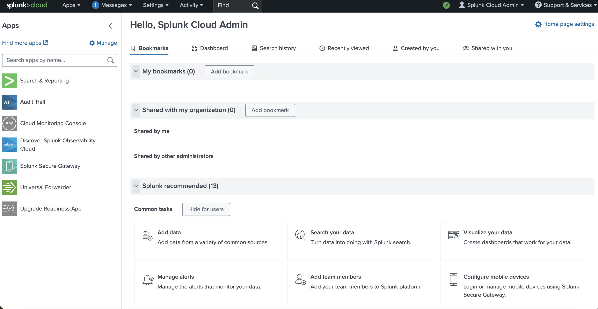
*Splunk Cloud interface after initial login*

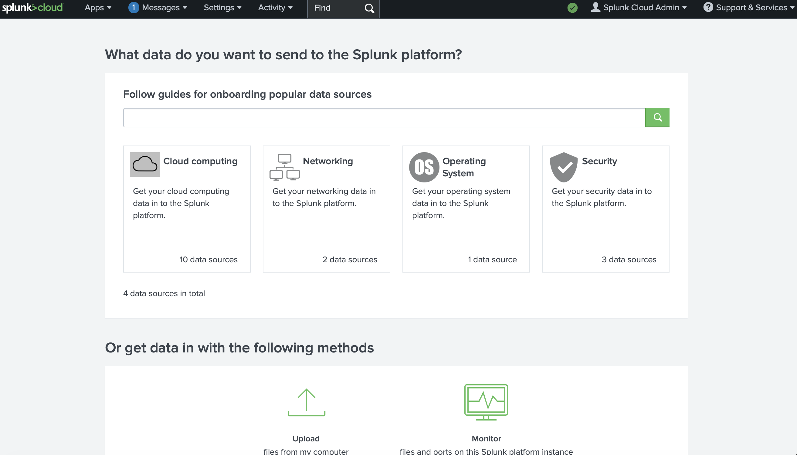
*Data ingestion interface*

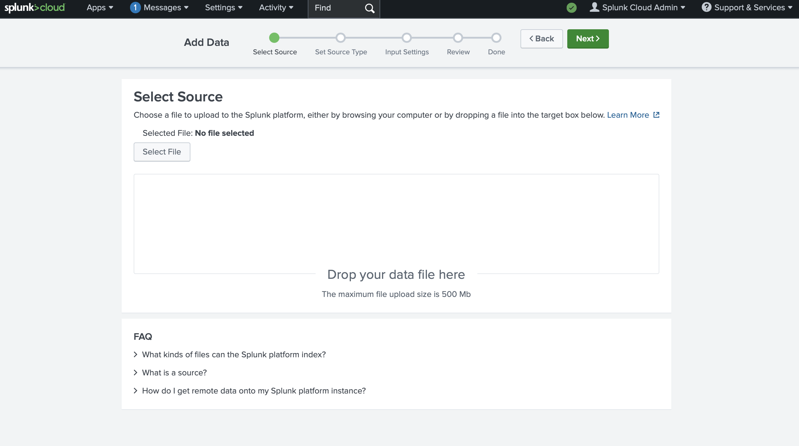
*Uploading Apache logs*

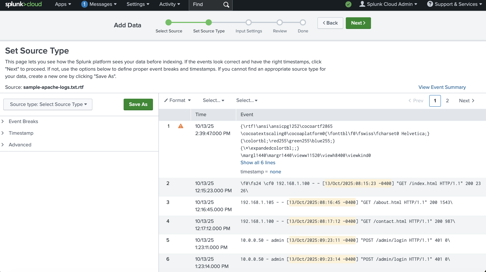
*Splunk parsing the log format*

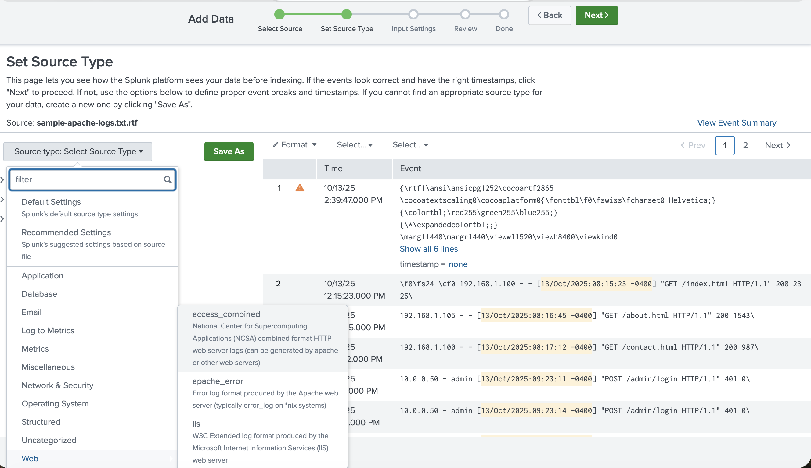
*Configuring the data source*

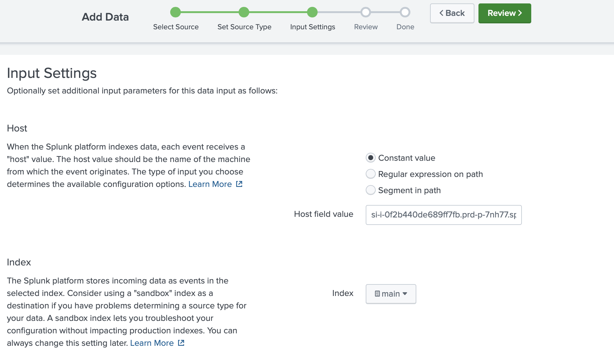
*Final review before ingestion*

### Investigation and Analysis
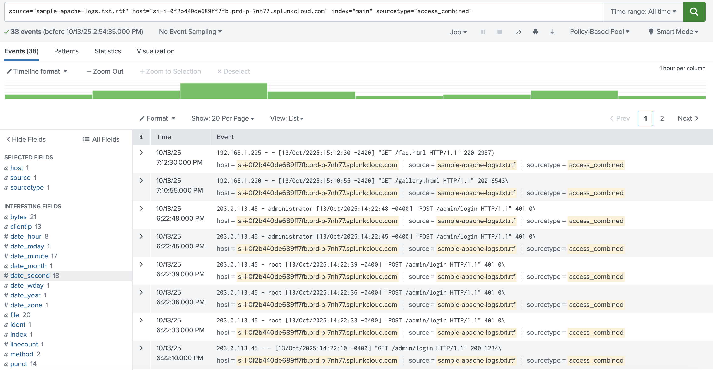
*Successfully loaded 38 events*

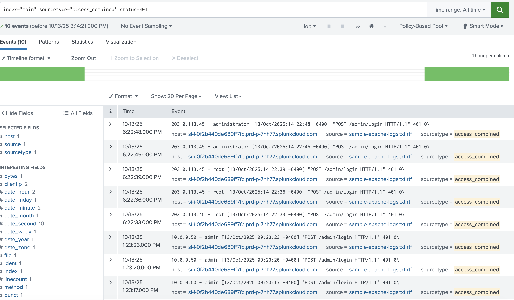
*Detected 10 failed authentication attempts*

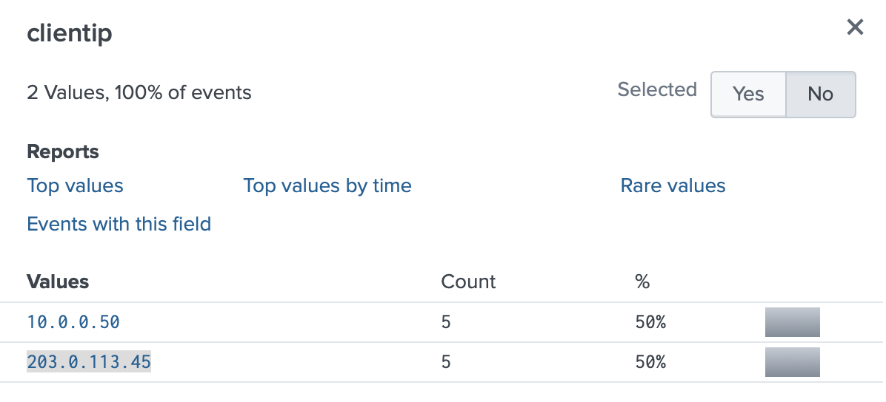
*Two IPs with multiple failed logins*

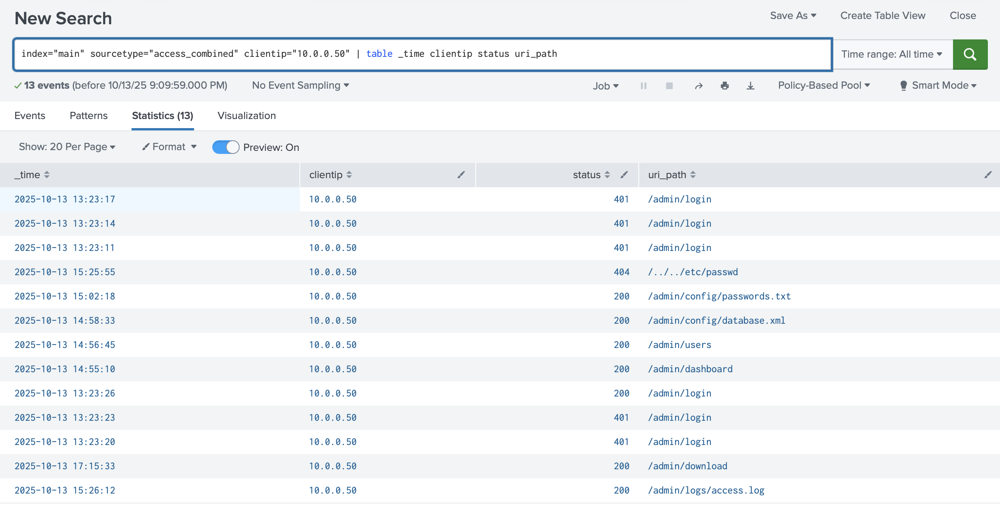
*Timeline of internal attacker activity*

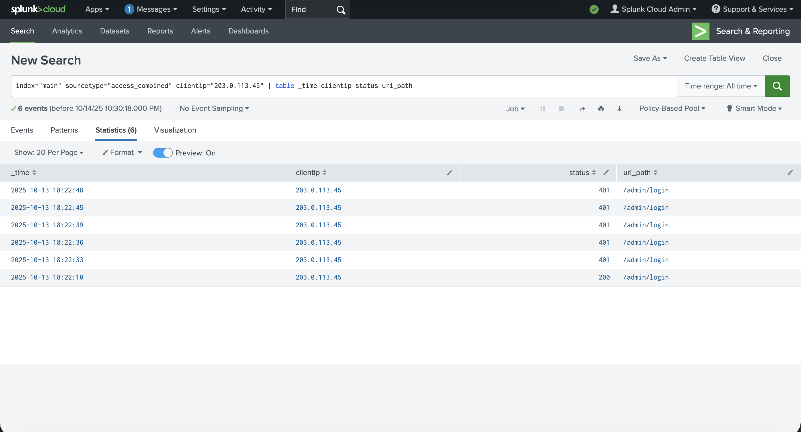
*External attack attempts (all blocked)*

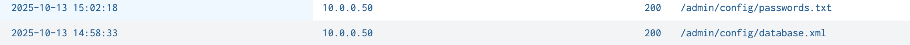
*Critical finding - password and database file access*

### Dashboard and Detection
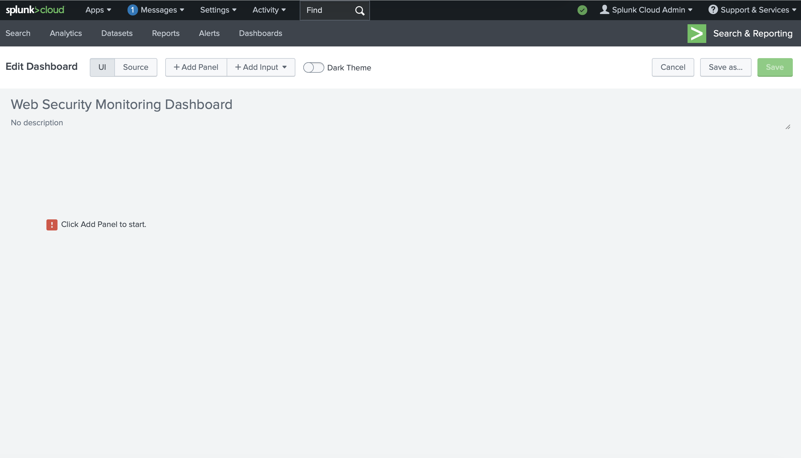
*Building the security monitoring dashboard*

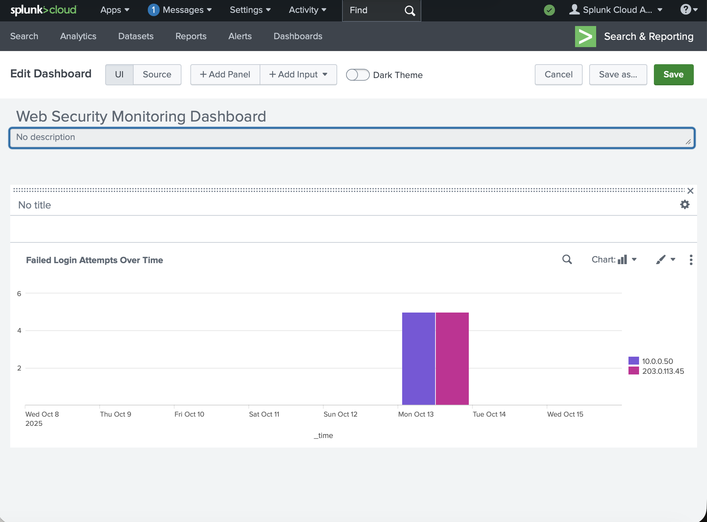
*Visualization of authentication failures*

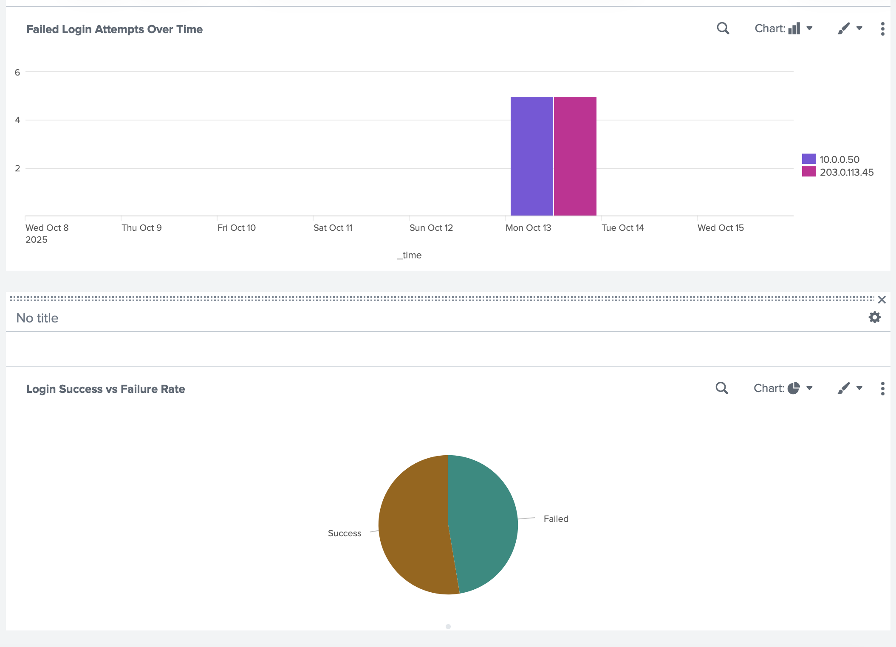
*Dashboard showing login trends*

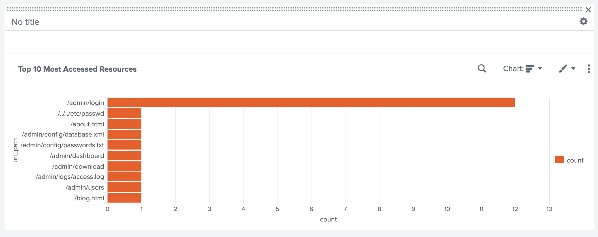
*Most accessed resources panel*

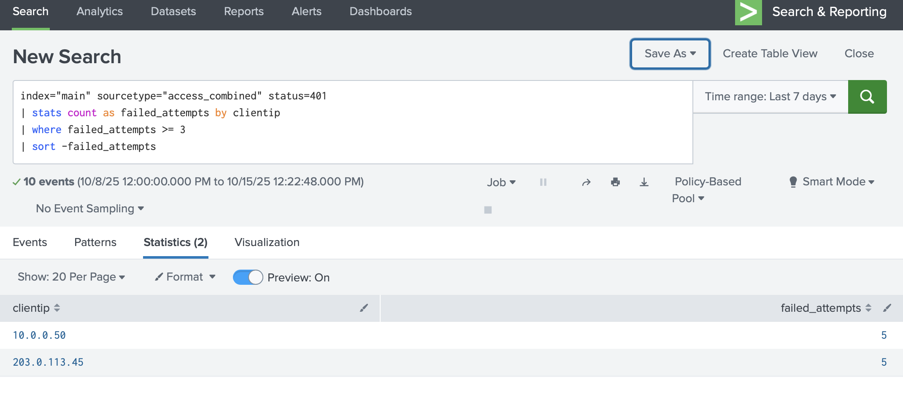
*Detection rule for brute force attacks*

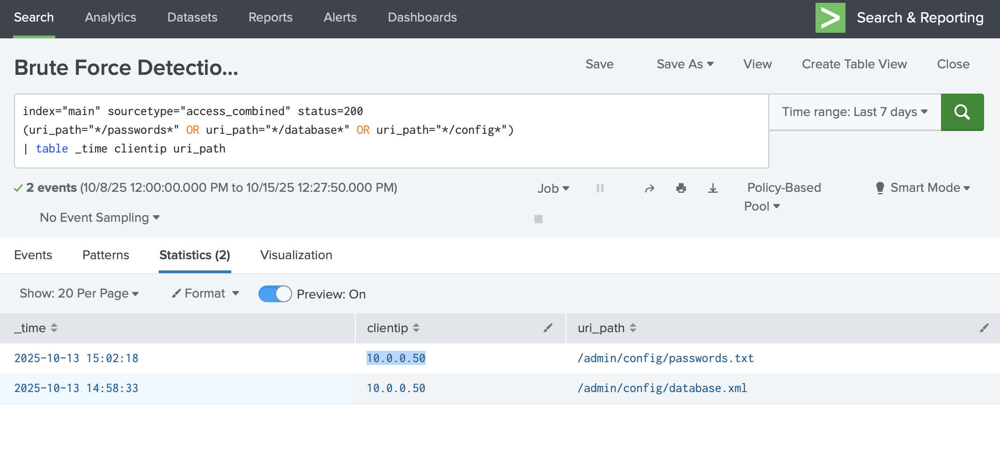
*Alert for critical file access*

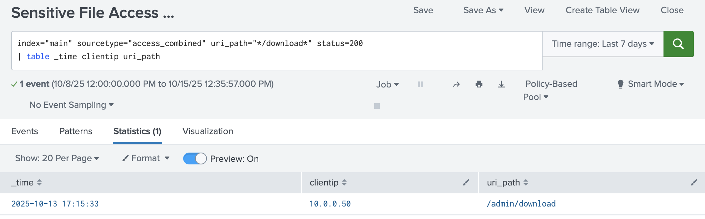
*Detection query for large downloads*

---

*This lab was completed as part of my cybersecurity training focused on SOC analyst skills and SIEM operations.*
